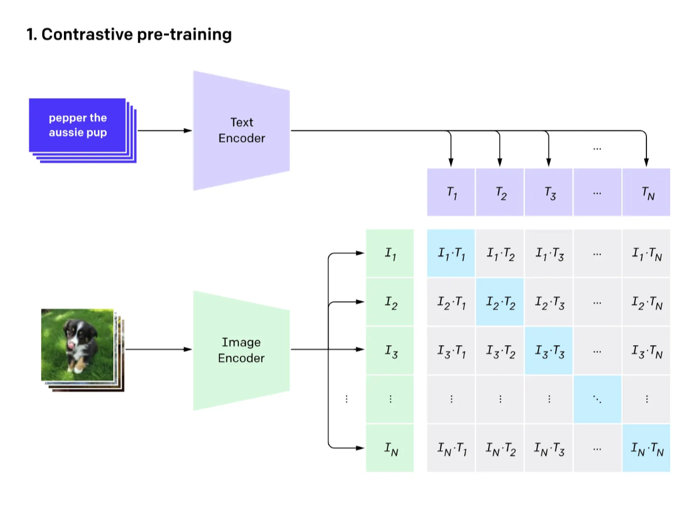

# Understanding CLIP: the Contrastive Language-Image Pre-train 

2025/10/10 Published on Medium [post](https://medium.com/@anna.ml4fun/understanding-clip-the-contrastive-language-image-pre-train-2994ae6e9b18)


## TL;DR

1. Introduced by OpenAI in Jan 2021 as a milestone, CLIP is a new training paradigm designed to learn visual representation from natural language supervision, particularly zero-shot image classification tasks. The most recent extension of CLIP includes the usage of CLIP’ text-encoder to convert prompts for image generation tasks, and image-text search, retrieval and recommendation tasks.  
2. This training architecture takes pairs of images and their captions to train 2 encoders – an image encoder and a text encoder – so that the outputs of the 2 encoders lands in a unified embedding space where semantically aligned images and texts are closer together. During training, the contrastive loss is used to enforce each image’s embedding vector closer to its paired caption’s embedding, and far away from embeddings of dissimilar images and captions. This contrastive learning objective is what drives the transferable power of CLIP.

## 1\. Why does CLIP shine?

1. Zero labeling cost: all training data of CLIP comes from images with their captions on the internet.  
2. Easy out-of-the-box plug-in ready for new image tasks(truly zero-shot), thanks to the large volume and variety of images the model was trained on. Say we need to classify brain tumors in CT scan images.   
   1. Some assembling required if we use ImageNet: we need to prepare a training set of CT scan images accompanied by their labels(eg. Benign and Tumor), remove the last few layers of the ImageNet model, and fine-tune the new head with the new training set.  
   2. In contrast, CLIP is ready to plug-in to the new task, all we need to do is “tell” CLIP’s text-encoder the names of the task’s visual concepts(in a structured way “a photo of XXX”) , and it will output a linear classifier of CLIP’s visual representations.  
3. Good performance on both benchmark and real world problems because it doesn’t “cheat” on the benchmark dataset.


## 2.The Training Data

CLIP is trained on 400 million pairs of image and text pairs scrapped from the internet; these 400M samples are, quote from OpenAI’s own words: “unfiltered, highly variated and highly noisy data.”

## 3.The Image-Encoder 

Input: image pixels  
Output: 2048-D(ResNet) or 786-D(ViT) embedding vectors, each vector represents the latent semantic representation of one training image.  
The neural net: ResNet50 and Vision Transformer. Because CLIP is not about proposing a new vision model but rather a new training paradigm shift, OpenAI used these 2 very different models to show that CLIP works regardless of the image encoder architecture.

Callout: Adopting a vision transformer is one of the 2 key algorithmic choices that lead to computational savings in CLIP.

## 4.The Text-Encoder

Input: image’s associated caption, e.g.  a sentence like “a black cat sitting in the coach”, tokenized using Byte Pair Encoding (BPE) — the same approach used in GPT models.  
Output: embedding vectors, each vector represents the latent semantic representation of the training caption.  
The neural net is a 12-layered Transformer with 8 attention heads

## 5.The Implementation of Contrastive Loss 

The key idea of “contrastive loss” is comparing similarities between pairs of image-text, with the end goal as achieving text and image alignment. Adopting contrastive loss the other key algorithmic choices that lead to 2x to 4x computational savings in CLIP.

### Data preparation

1. Projection Head: The linear layer that unified the dimensions of text and image encoders. As mentioned in previous sections, the 2 encoders’ output embedding vectors are of different dimensions, which makes it hard to make an apple to apple comparison. To clear the differences, we implement some linear transformations to project the 2 different modality’s embedding space into one common 512-dimension of embedding space.   
   Because CLIP wants to preserve the encoder’s learned structure while just aligning scales and coordinate systems, the projection head is linear (non-linear or MLP would change the structure). The projection head is trained jointly with the encoders during the contrastive learning.  
2. Normalization: L2 normalization comes after the projection head to make all vectors in the embedding space have about the same magnitude of values, ie. unit length. Making the embedding vectors Cosine similarity ready.

### The loss

#### High level idea

The embedding vectors produced by the text and image encoders are shown above, with I1 and T1 being the image embedding and text embedding vectors of 1 image-text pair of the little aussie pup, N stands for the number of samples in the training batch. The dot product I1\*T1 stands for the Cosine similarity between I1 and T1.  
The blue diagonal of the embedding matrix(blue colored blocks) stands for the Cosine similarity of the text embedding and image embedding vectors for each matching pair of text and image. While the other grey blocks are non-matching pairs’ Cosine similarity.  
Recall the goal of contrastive learning is to make so that matching pairs have high cosine similarity, and non-matching pairs have low similarity, reflected in the matrix above: we want to update the neural net’s parameters to force the aggregates of blue blocks to be very large and the aggregates of grey blocks to be very small. (\*aggregates here means relative rankings)

#### The math:


#### Caveats in parallel training:

1. Loss happens at the batch level: During training, CLIP does not create a 400M × 512 matrix and store it. Instead, it processes mini-batches — for example, 32k or 64k pairs per step — and computes embeddings on the fly to calculate the contrastive loss.   
2. Batches are computed in parallel and cross-nodes, but each batch will not construct their own coordinate system and update their own encoders’ parameters. Instead, all batches share the same model parameters (image encoder, text encoder, and projection heads), gradients from each batch are averaged (synchronized) across all GPUs before the global parameters get updated. This synchronization is typically implemented via DistributedDataParallel (DDP) in PyTorch, with all-reduce gradient averaging.

### Nuances In the Embeddings of Cross-pair Objects:

The contrastive loss doesn’t explicitly enforce different-but-semantically-similar image-text pairs   (e.g. two cat images with two cat captions) must all cluster super tightly, but similar objects will be relatively closer together, e.g. the distance between cats and dogs will be smaller than the distance between cats and X-rays.

## 6.The Unified Embedding Space

In typical image classification tasks, the output of the neural net would be a (n\_sample, n\_label) matrix, with each row as a softmaxed vector of predicted probabilities on a finite set of labels (eg. in MNIST dataset, each image would have a 1x10 vector representing what’s the probability of this image’s digit being from 0 to 9). Because the vector has been softmaxed, one position of this vector would have a larger probability than all the other positions and hence this position is the winning label.

For CLIP, the unified embedding space is different in the following aspects:

1. Embedding is not a stored matrix, but a function that maps inputs to vectors.  
2. There’re no “fixed-digits” like axes, instead, each one of the 512D are semantic features without predefined meaning, nor do we need to define what each axes are, because the embedding contains the geometric information of where (almost) everything is. Take an easy example, no one hard code what “dog” or “sky” or “sadness” are to the model, but when the model learns from millions of pairs of images and captions, these concepts emerge as clusters or directions in the embedding space.     
   


### An example: Picture of cat and pineapples and their text and image embedding


1. Cosine similarity matrix is, with rows representing the image and columns as text
```
   tensor(\[\[0.2832, 0.2036\],
              \[0.1956, 0.3286\]\])
```


2. How to read these numbers:  
   * Cat ↔ “a photo of a cat” → 0.2832  
     * Cat ↔ “a photo of a pineapple” → 0.2036  
     * Pineapple ↔ “a photo of a cat” → 0.1956  
     * Pineapple ↔ “a photo of a pineapple” → 0.3286  
3. The diagonals (0.28, 0.33) are higher than the off-diagonals (0.20, 0.19), which means the CLIP is able to achieve its goal of paired image-texts getting high similarity scores while unpaired image-texts get lower scores. Remember that CLIP isn’t optimized to make all unrelated pairs orthogonal, therefore we can see the off-diagonals are not nearly approaching 0\.   
4. One caveat is that all the absolute values of cosine similarities are not that far apart. That’s because CLIP is normalized to unit-length, so the cosine similarities clustered around small numbers usually between 0.1 to 0.4, and even randomly unrelated objects get 0.2 similarities. This doesn’t bother us making the right text2image predictions because we only care about the relative ranking of the similarities scores.

## 7.Use Cases of CLIP

1. Zero-shot classification: CLIP pre-trains a text-encoder and an image-encoder to predict which text is paired with which image in the training set.  
2. Prompt based image generation: As a pre-train model, CLIP is great for transfer learning, stable diffusion will use the pre-trained text encoder to "interpret" the prompts of the image generation tasks into a commonly adopted embedding currency suitable for a variety of  images.  
3. CLIP’s structure closely parallels the two-tower (dual-encoder) architecture widely used in recommendation systems and retrieval models: where we have 2 encoders that would produce user embeddings and item embedding so as to make the users maps closer to the items they like/will like and far away from items they don’t like.


In a nutshell, the “embedding alignment” concept unifies multimodal learning, retrieval, and recommender design under a shared geometric learning principle.

## 8.Some concerns and potential pitfalls

1. Quality and Imbalanced Coverage: The training sets comes from the images and annotations/captions from the internet, so there’s no guarantee of the quality of the caption (eg. how accurate are the captions to the images) and the coverage of the image-text pairs (e.g. for animal category, the training set might be highly skewed towards cats and dogs vs uncommon animals). Does quality and coverage matter for prediction accuracy?  
2. Text Granularity: In the training set, the caption is often-times a very high level summary of the images, most of the times are major objects and background in the image, thus the granularity of the text inputs are really low, while images themselves contain very rich information. Would this mismatch of granularity cause the final embedding space to only contain low granularity information(in favor of the text) or high granularity information(in favor of the image)? If it’s the former, I think it would impact the downstream image generation tasks because a low granularity input text prompt can only produce very coarse images.  
3. Is it required of the image-encoder to know where the borders of the objects(visual concepts) in the images are in order to learn the visual representations?

## 9.Interesting Facts

1. It can count\!


2. Bad at guessing numbers(like really bad, not good as an OCR)


## Appendix:

1. #### The math of Projection Head and L2 Normalization

  

2. #### The math of Contrastive Loss function:

   1. 
   2. 
   3. 
   4. 
