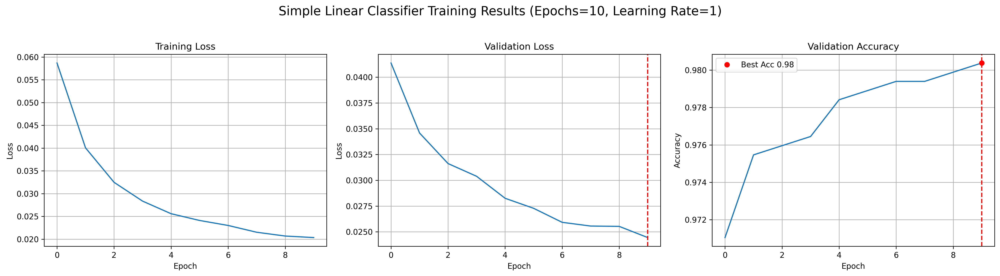
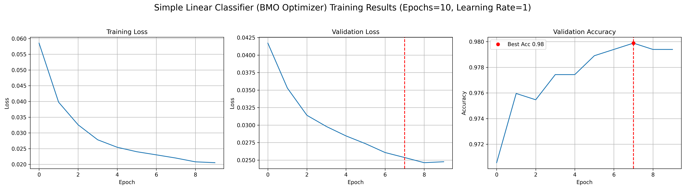
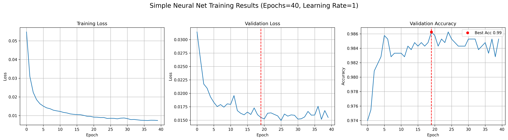
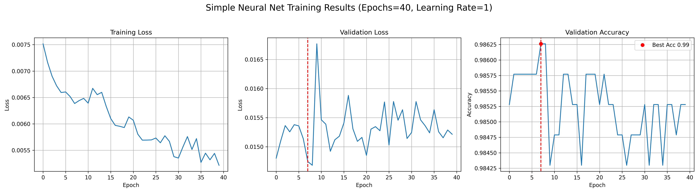

# Key take-aways
1. configure the dimensions of each tensors objects carefully

2. GPU takes floats, so everything needs to be floats

3. check the scale of weights and gradients, if the scale differs too much, select a big learning_rate to step

4. In vision tasks, normalize the Pixels to [0,1], avoids saturation in nonlinearities,
keeps gradients at useful magnitudes,
and plays nicely with optimizers like SGD/Adam.
   * keeping original scale: would make the raw logits too big and push the sigmoid to 0 or 1. gradients could also vanish and training unstable. it could overflow (value > 65000 would become `Inf`)
   * scaling down too much: signals can vanish relative to float precision

5. Be mindful about the Pytorch Autograd feature, it automatically record all operations on your weights tensors in the computation graph. We only want the loss function to be recorded in the computation graph for calculating gradients. Therefore, in all other places such as updating the weights and calculating the loss of validation set, put them inside `torch.no_grad()` to pause the gradients tracking.

6. last but not least, save all the outputs with a history of all the variations that I tried for more efficient experiments, let's look at the results

#### Linear regression with built-in SGD optimizer

#### Linear regression with my own SGD optimizer

#### 3-layer Neural Net with ReLu as middle layer non-linear activation with different learning rates and epoch

#### ❗❗❗ Why are the validation loss so zig-zag in the 2 NN training cycles? It looks pretty smooth in simple Linear Regression cycles.
Also, the validation accuracy of NN is jumping within very small ranges (0.984, 0.985), is that normal?

